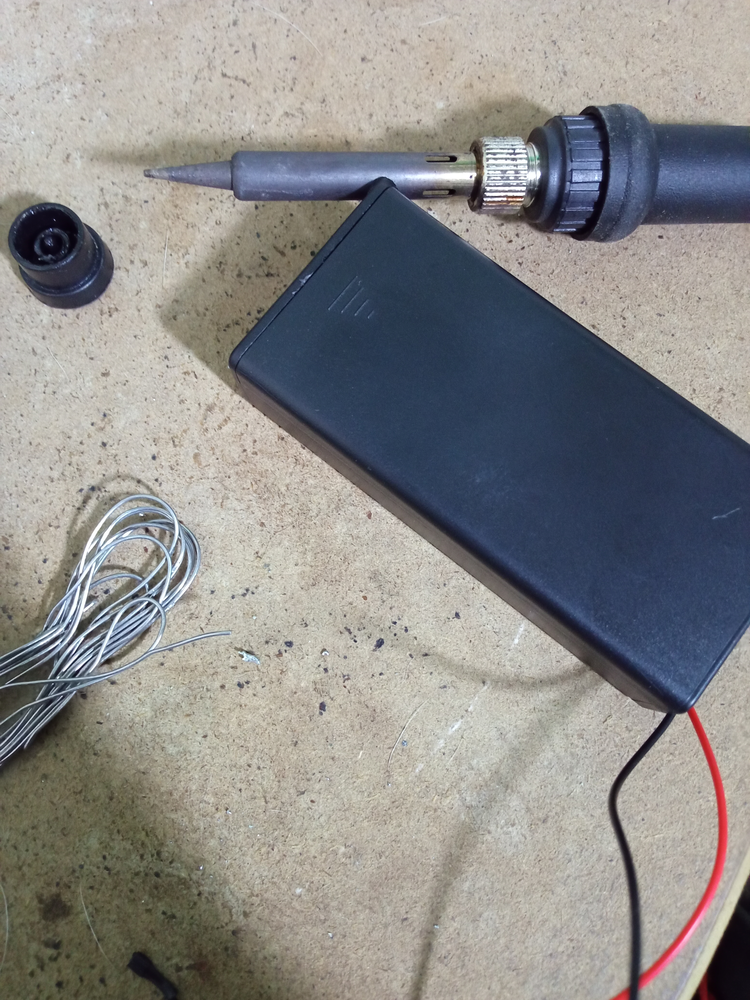
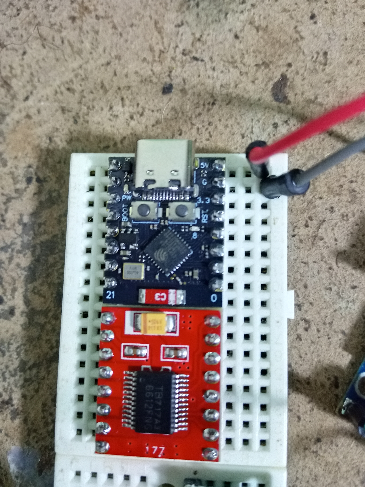
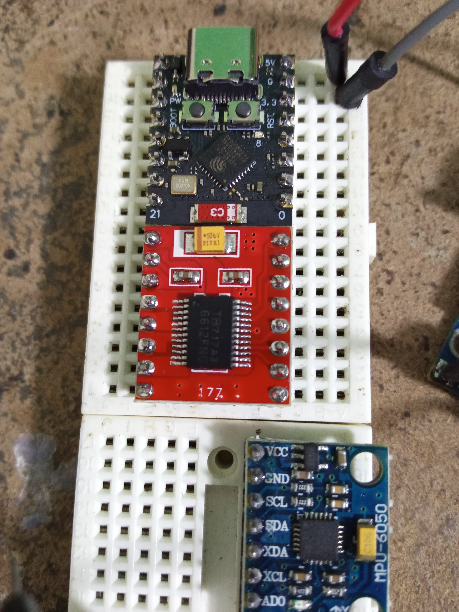

# 🤖 Robot Móvil Multi-Propósito (ESP32-C3)

> **Estado del proyecto:** 🚧 *En desarrollo (Prototipado inicial)*  
Bitácora de construcción y desarrollo de un robot móvil de dos ruedas multifunción: Sumo, Siguelíneas, Control por Bluetooth y Autobalanceado.

---

## 📌 Descripción del Proyecto

Este proyecto consiste en el diseño y desarrollo de una plataforma robótica móvil impulsada por el microcontrolador **ESP32-C3 Super Mini**. El objetivo es crear una base modular capaz de cumplir múltiples modos de operación:

* **Modo Sumo:** Detección de oponentes y bordes del dojo.
* **Modo Siguelíneas:** Seguimiento de trayectoria apoyado por sensores ópticos e inerciales.
* **Modo Control Remoto:** Manejo inalámbrico mediante Bluetooth.
* **Modo Auto-balanceado:** Control PID de inclinación en dos ruedas usando IMU.

---

## 🛠️ Componentes y Hardware

### Control y Electrónica
* **Microcontrolador:** ESP32-C3 Super Mini
* **Controlador de Motores:** Driver TB6612FNG (Dual H-Bridge)
* **Regulador de Voltaje:** Módulo Step-Down LM2596 (Ajustado a 5V)
* **Alimentación:** Porta pilas / Batería externa dedicada

### Actuadores y Sensores
* **Motores:** 2x Motorreductor TT con ruedas de hule de alto agarre
* **Sensor de Inercia (IMU):** MPU6050 (Acelerómetro + Giroscopio)
* **Sensores de Distancia:** 2x HC-SR04 (Ultrasonido para modo Sumo)
* **Sensores de Línea:** 2x TCRT5000 (Infrarrojos para lectura de contraste)

---

## 📐 Estructura Chasis (Prototipo v1)

Para el chasis inicial se reutilizó una **cajetín de paso eléctrico PVC 4x4"**, la cual ofrece:
* Aislamiento eléctrico y estructura liviana/resistente.
* Espacio interno para alojar los motores TT asegurados con sujetacables (*tirraps*).
* Apertura lateral para ejes y ruedas.
* Espacio superior para acomodar las protoboards de prueba y módulos de alimentación.

---

## 📸 Estado Actual del Ensamble

Actualmente el prototipo se encuentra en fase de integración física y cableado de pruebas:

1. **Montaje de Motores:** Ajustados dentro de la caja de paso mediante tirraps.
2. **Pruebas en Protoboard:** Conexión del ESP32-C3 Super Mini, driver TB6612FNG, MPU6050 y regulador LM2596.
3. **Alimentación:** Módulo LM2596 calibrado para suministrar energía estable a los componentes lógicos y de control.

*(Añade aquí las imágenes subidas al repositorio)*
```markdown





